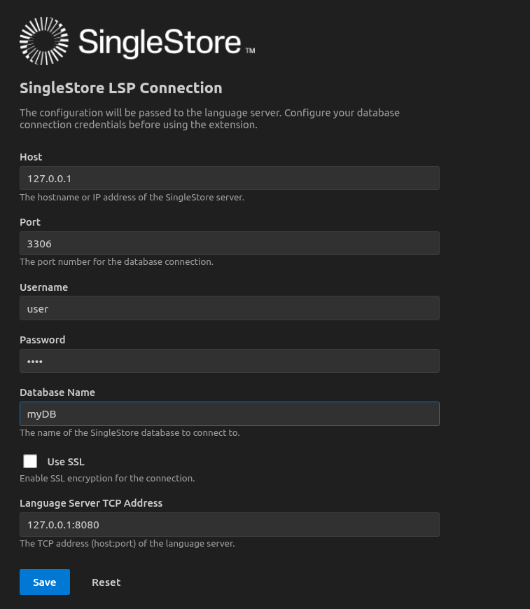

# SingleStore Language Client for VS Code

A VS Code extension that provides SQL language support for [SingleStore](https://www.singlestore.com/) by connecting to the SingleStore Language Server via LSP.

## Prerequisites

This extension requires a running **SingleStore Language Server** to function. You can download the latest server release from the [singlestore-labs/language-server](https://github.com/singlestore-labs/language-server) GitHub repository.

## Installation

1. Download the `.vsix` file from the [Releases](https://github.com/singlestore-labs/singlestore-vscode/releases) page.
2. In VS Code, open the Command Palette (`Ctrl+Shift+P`) and run **Extensions: Install from VSIX…**
3. Select the downloaded `.vsix` file.

Alternatively, search for **SingleStore Language Client** on the VS Code Marketplace, in the Extensions view (`Ctrl+Shift+X`).

## Configuration

Open the configuration panel by running the command **SingleStore: Connection Configuration** from the Command Palette (`Ctrl+Shift+P`).

### Settings

| Setting | Default | Description |
|---------|---------|-------------|
| `singlestore.host` | `127.0.0.1` | SingleStore database host address |
| `singlestore.port` | `3306` | SingleStore database port number |
| `singlestore.username` | | Username for database authentication |
| `singlestore.password` | | Password for database authentication |
| `singlestore.databaseName` | | Name of the database to connect to |
| `singlestore.useSSL` | `false` | Enable SSL for the database connection |
| `singlestore.languageServerAddress` | `127.0.0.1:4040` | TCP address (host:port) of the language server |

These settings can also be configured directly in VS Code's Settings (`Ctrl+,`) under **SingleStore connection settings**.

## Usage

1. Start the SingleStore Language Server (see [singlestore-labs/language-server](https://github.com/singlestore-labs/language-server) for instructions).
2. Open VS Code and configure the connection using the **SingleStore: Connection Configuration** command.
3. Open or create a file with the `.s2db.sql` extension to activate SQL language features.

## Use with SQLTools

This extension works well alongside the [SQLTools](https://marketplace.visualstudio.com/items?itemName=mtxr.sqltools) extension, which provides database management features such as browsing database objects and running queries. To connect SQLTools to a SingleStore database, install the [SingleStore Driver for SQLTools](https://marketplace.visualstudio.com/items?itemName=singlestore.sqltools-singlestore-driver).

## File Association

The extension associates with files using the `.s2db.sql` extension and provides syntax support for SingleStore SQL.
